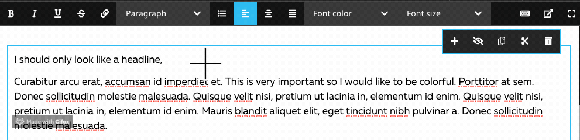
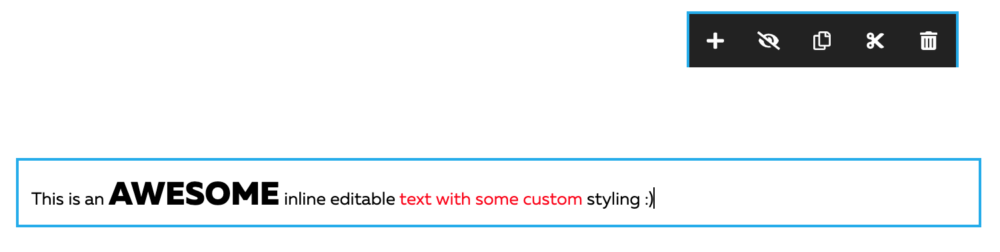

# TechDivision.CkStyles

This package allows to add different styles(with your own classes) for the CkEditor in Neos. The styles and classes
depend on your implementation.


**Demo:**



**Example output:**



```html
<p>
  This is an 
  <span class="my-class-size-large">awesome</span> 
  inline editable 
  <span class="my-class-red">text with some custom</span> 
  styling :)
</p>
```

But why? Often customers want to highlight some text for example with font size but don't use a headline for SEO reasons
or want to add an icon, adjust the font color ... 

## Getting started

Default composer installation
```
composer require techdivision/ckstyles
```

Define some global presets for usage in different NodeTypes:
```
TechDivision:
  CkStyles:
    InlineStyles:
      presets:
        'fontColor':
          label: 'Font color'
          options:
            'primary':
              label: 'Red'
              cssClass: 'my-class-red'
            'secondary':
              label: 'Green'
              cssClass: 'my-class-green'
            '':
              label: 'unset color'
              cssClass: null
        'fontSize':
          label: 'Font size'
          options:
            'small':
              label: 'Small'
              cssClass: 'my-class-size-small'
            'big':
              label: 'Large'
              cssClass: 'my-class-size-large'
            '':
              label: 'unset color'
              cssClass: null
```
Example: [Configuration/Settings.yaml](Configuration/Settings.yaml)

Activate the preset for your inline editable NodeType property:
```
'Neos.NodeTypes.BaseMixins:TextMixin':
  abstract: true
  properties:
    text:
      ui:
        inline:
          editorOptions:
            inlineStyling:
              fontColor: true
              fontSize: true
```
Example: [Configuration/NodeTypes.Override.BaseMixins.yaml](Configuration/NodeTypes.Override.BaseMixins.yaml)

Add the styling for your presets in your scss, less or css:
```
.my-class-red {
  color: red;
}
.my-class-green {
  color: green;
}
.my-class-size-small {
  font-size: 10px;
}
.my-class-size-large {
  font-size: 25px;
}
```

## Development 
This project works with yarn. The build process given by the neos developers is not very
configurable, only the target dir for the buildprocess is adjustable by 
package.json.

```
nvm install
```

If you don't have [yarn](https://yarnpkg.com/lang/en/docs/install/) already installed: 
```
brew install yarn
```

Build the app:
```
./build.sh
```

## Contribute

You are very welcome to contribute by merge requests, adding issues etc.

**Thank you** 🤝 [Sebastian Kurfürst](https://twitter.com/skurfuerst) for the great workshop which helped us 
implementing this.